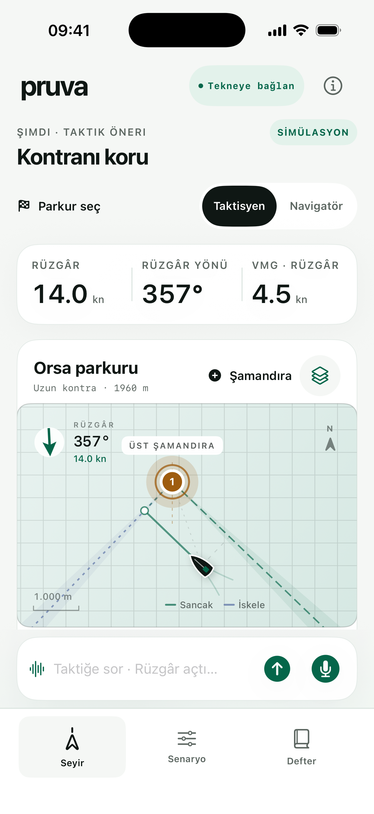
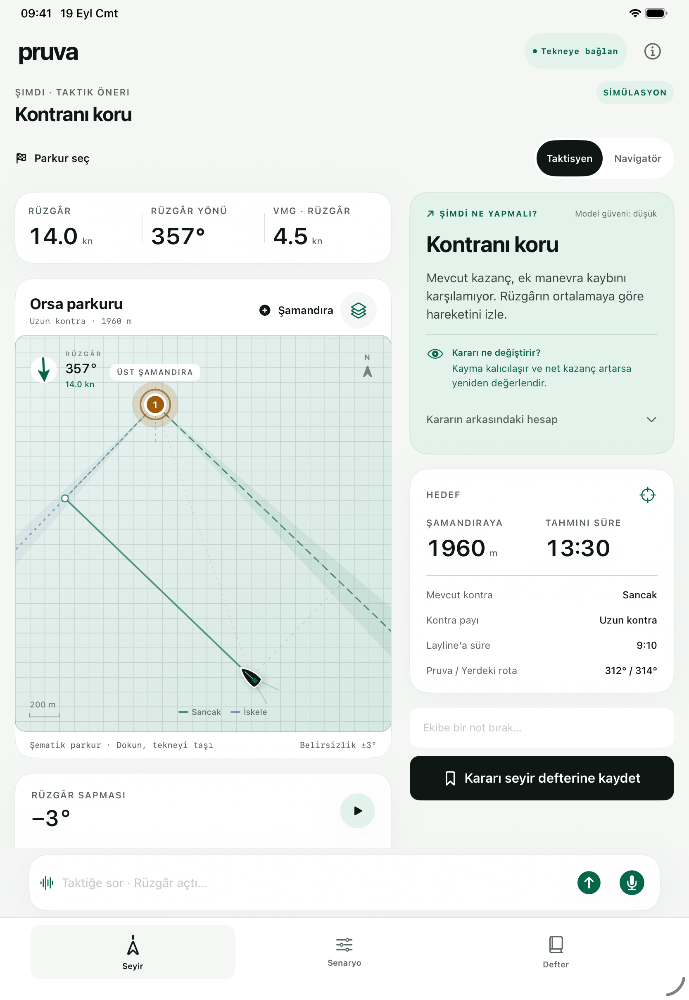
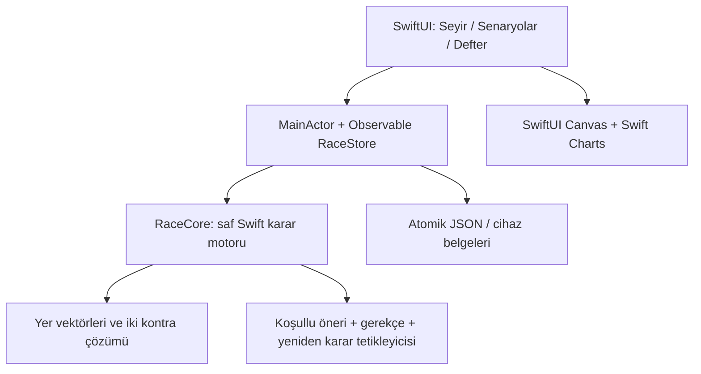

# Pruva

**Rotayı gör. Doğru anda karar ver.**

iPhone ve iPad için yerel SwiftUI yarış karar asistanı. Taktisyen ve navigatörün rüzgâr, layline, kontra payı ve manevra maliyetini aynı görsel üzerinden değerlendirmesi için tasarlandı. Kırık beyaz zemin, yüksek kontrastlı tipografi, deniz yeşili vurgular ve büyük dokunma alanları kullanır. Taktik önerisi ilk bakışta görünür; sesli/yazılı yardım çubuğu ekranın altında sabittir.

Uygulama **çevrimdışı simülasyon / manuel karar laboratuvarı** ile **Wi-Fi NMEA 0183 veri alımı** sunar. TCP istemcisi veya UDP unicast üzerinden teknenin GPS, heading, suya göre hız ve rüzgâr verileri cihazda işlenir. Canlı öneri için gerekli güncel ölçümler ve gerçek şamandıra gerekir; eksik/eski veri öneri üretmez. Gerçek tekne bağlantısı henüz sahada doğrulanmadı. [Bağlantı kurulumu ve test akışı](docs/LIVE_DATA.md).

<p>
  
  
</p>

[iPhone ekranını görüntüle](docs/screenshots/premium-iphone.png) · [iPad ekranını görüntüle](docs/screenshots/premium-ipad.png)

Bu ekran görüntüleri simülasyon akışını gösterir.

[Sentetik NMEA ile alınmış iPad start hattı](docs/screenshots/ipad-start-hatti.png)

## Çalışan özellikler

- **Seyir:** dokunarak taşınabilen tekne, rüzgâra ve akıntıya göre dönen layline'lar, alternatif kontra yolları, belirsizlik bantları, ölçekli şematik parkur.
- **Hızlı hedef girişi:** parkurdan tek dokunuşla şamandıra düzenleme; canlı modda koordinat veya güncel tekne GPS konumu, simülasyonda yön/mesafe. Geçersiz girişler kaydedilmez.
- **İki ekip rolü:** taktisyen için VMG ve karar gerekçesi; navigatör için VMC, yer rotası, hedef mesafesi ve kontra süreleri.
- **Karar motoru:** ortalamaya göre shift, uzun/kısa kontra, ek manevra maliyeti, kullanılabilir süre, basınç varsayımı, kirli hava ve son yaklaşım.
- **Senaryolar:** uzun kontra, süren kafalama, layline eşiği, pupa, son yaklaşım ve start provası. Hız, açı, shift, akıntı ve maliyet kaydırıcıları anında hesaplanır.
- **Rüzgâr oynatma:** örnek salınımı başlat/duraklat; kullanıcı girdilerinden oluşan grafik. Referans değişince grafik aynı gerçek yönleri yeni ortalamaya göre gösterir.
- **Seyir defteri:** karar ve ekip notunu cihazda sakla; eski koşulları haritada aç; farklı rüzgârla karşılaştır; metin notunu iOS paylaşım menüsünden dışa aktar.
- **Wi-Fi ölçüm yolu:** yapılandırılabilir TCP host/port veya UDP unicast dinleme; SOG/STW ve gerçek/görünür rüzgâr ayrımı; 15 saniye güncellik kontrolü ve 2 dakikalık dairesel rüzgâr referansı. Ham telemetri yüklenmez.
- **Start hattı:** komite/starboard ve şamandıra/port uçları teknenin güncel NMEA GPS konumundan ayrı ayrı pinlenir; iki uç alınınca çizgi ve uzunluğu parkurda görünür.
- **Sesli karar desteği:** Türkçe bas-konuş ve yazılı komut; rüzgâr, layline ve durum bildirimine ölçümlere dayalı sesli, hareketli görsel ve yazılı yanıt. Canlı iPhone'da isteğe bağlı ses tuşu pin modu.
- iPhone'da dikey akış, geniş iPad ekranında parkur ve kararın yan yana yerleşimi.

## Xcode'da çalıştırma

Gereksinim: Xcode 26+, iOS/iPadOS 26+. RaceCore paketi eski platform hedeflerini korur.

1. `Pruva.xcodeproj` dosyasını Xcode ile açın.
2. `Pruva` scheme'ini ve bir iPhone/iPad simülatörünü seçin.
3. **Run**. Harici paket, sunucu, hesap veya API anahtarı gerekmez.

Minimum uygulama hedefi **iOS / iPadOS 26**; fiziksel cihaz için Signing & Capabilities altında kendi Apple geliştirme takımınızı seçin. App Store / TestFlight dağıtımı bu depoya push etmekten ayrı bir adımdır; bu çalışma kapsamında yapılmadı.

Proje tanımını yeniden üretmek gerekirse, kurulu [XcodeGen](https://github.com/yonaskolb/XcodeGen) ile `xcodegen generate` çalıştırın. Üretilmiş Xcode projesi depoda bulunduğu için normal kullanımda bu araç gerekli değildir.

```sh
swift test
xcodebuild -project Pruva.xcodeproj -scheme Pruva \
  -destination 'generic/platform=iOS Simulator' \
  -derivedDataPath build CODE_SIGNING_ALLOWED=NO build
```

Arayüz testleri için `xcodebuild -showdestinations -scheme Pruva -project Pruva.xcodeproj` çıktısından bir simülatör seçip `-destination 'platform=iOS Simulator,id=…' test` kullanın. `PruvaUITests` senaryo geçişini, rol/katman kontrollerini ve karar kaydını gerçek uygulama üzerinden doğrular.

## Mimari



- [iOS mimarisi ve sensör/video yol haritası](docs/ARCHITECTURE.md)
- [Karar denklemleri, birimler ve varsayımlar](docs/DECISION_MODEL.md)
- [Ürün akışı ve görsel dil](docs/PRODUCT.md)
- [Doğrulama kaydı](docs/VALIDATION.md)
- [Canlı NMEA kapsamı, tekne kurulumu ve yerel test yayıncısı](docs/LIVE_DATA.md)

`Sources/RaceCore` yalnız Foundation kullanır ve Swift Package olarak bağımsız test edilir. `Pruva` görünüm ve cihazda saklama katmanıdır. İş mantığı Canvas çizim koduna bağlı değildir.

## Modelin sınırları

Girdi hızları knot, hesap konumları yerel doğu/kuzey düzleminde metre, süreler saniye ve rüzgâr yönü kuzeyden saat yönünde **geldiği yön** olarak tanımlıdır. Yer hızı = suya göre tekne hızı + akıntı. Canlı GPS ve gerçek şamandıra enlem/boylamı, yakın parkur hesabı için yerel metre düzlemine çevrilir; GPS SOG, suya göre STW'nin yerine geçmez.

Kazanç modeli güncel rüzgârın verilen süre boyunca devam edip sonra referans ortalamaya döndüğü iki varsayımsal rotayı karşılaştırır. Bu bir tahmin servisi değildir. Basınç faydası iki rotanın diğer kontradaki **farklı maruz kalma süresine** uygulanan yaklaşık katkıdır. Simülasyonda tekne hızı kullanıcı girdisidir; canlı hesapta güncel STW gerekir. Hedef açı ve manevra varsayımları ayrıca ayarlanır; rüzgâr hızından otomatik polar türetilmez. Güven etiketleri ölçülmüş olasılık değildir.

Şematik parkur deniz haritası veya parkurun farklı noktalarındaki rüzgâr haritası değildir. Yarış kuralları, rakip önceliği ve temiz manevra alanı ekip tarafından değerlendirilir. Broadcast/multicast, AIS, tekneye özel polar, filo takibi ve video üzerine veri bindirme bu sürümün dışındadır. Başlangıç mimari belgelerindeki sensör yol haritasının güncel kapsamı [LIVE_DATA.md](docs/LIVE_DATA.md) ile açıklanır.

Temel ürün mantığı, kullanıcının [paylaşılan yarış stratejisi konuşmasından](https://chatgpt.com/share/6aa68eb3-a6ec-83eb-b5ba-6226bfed7c7d) türetildi. Yelken ve Apple birincil kaynakları mimari/karar belgelerinde bağlantılıdır.

## Erişilebilirlik ve cihaz içi yardım

Metinler Dynamic Type stillerini kullanır; erişilebilirlik boyutlarında kart satırları dikey açılır. Harita VoiceOver özeti ve simülasyonda yön eylemleri sunar. Tekne sekmesi marka bağımsız NMEA 0183 TCP / UDP unicast kurulumunu ve durum yardımını içerir; doğrudan Bluetooth, USB veya NMEA 2000 desteği değildir.

Cihaz içi dil yardımı Seyir ekranında isteğe bağlı açılır. Foundation Models yalnızca okuma komutunu sınıflandırır; start pini yazma komutları kesin eşleştirmede kalır. Sayısal hesaplar ve yanıt metinleri RaceEngine'den gelir. Seyir defterindeki inceleme özeti, son 30 kayıttan en fazla üç mevcut kaydı seçer; yeni sayısal iddia üretmez. Apple Intelligence/model/Türkçe desteği yoksa standart komutlar çalışır ve modelin durumu açıklanır. Konuşma tanıma sunucuya geri düşmez.

## Seyir uyarıları

Çevrimdışı **Start provası** senaryosunda 120 m örnek hat çizilir. Senaryolar sekmesindeki mesafe sürgüsü veya “Hatta yaklaş · 25 m” düğmesiyle tekne yaklaştırılıp kırmızı uyarı ve start mesafesi denenebilir. “Hız düşüşünü dene” düğmesi 6,4 kn başlangıç hızını 11 saniye sonra 4,8 kn'ye indirir; mevcut süre filtresi 5 saniye sonra uyarı verir. Kart ve sesli bildirim bu veriyi açıkça **simülasyon** olarak etiketler. Gerçek GPS pinleri bu provada kullanılmaz ve değiştirilmez.

[Simülasyon start yaklaşması ekranı](docs/screenshots/simulated-start-approach.png)

Layline'a hesaplanan süre 30 saniyeye indiğinde veya güncel GPS ile iki start pini arasındaki hat parçasına mesafe 30 metreye indiğinde ekran yumuşak kırmızı renkte yanıp söner. Uyarı 45 saniye / 40 metreden sonra söner; Hareketi Azalt ayarı açıksa yanıp sönme yerine sabit vurgu gösterilir. İkinci start pini alındığında start kartı en kısa mesafeyi metre olarak gösterir; “Mesafeyi söyle” düğmesi bunu seslendirir. Hat uzantısındaki tekne için en yakın pine mesafe verilir. Eski GPS konumu mesafe üretmez.

Canlı bağlantıda hız kaynağı olarak önce STW, yoksa SOG kullanılır ve kaynak değişiminde karşılaştırma yeniden başlar. Simülasyonda hız uyarısı yalnızca simülasyon hızına dayanır ve “SİM” olarak etiketlenir. İlk 10 saniye / 5 geçerli örnekten sonra önceki ortalamaya göre en az %15 ve 0,5 kn düşüş 5 saniye sürerse hız uyarısı çıkar. Tek bir kötü örnek veya tekrar işlenen eski zaman damgası uyarı üretmez. Uyarılar sesli okunurken tekrarları sınırlandırılır. Bunlar saha denemesi yapılmamış destekleyici göstergelerdir.

Görsel düzen, [Beautiful UI öneri kartındaki](https://www.beautifului.dev/#recommendation-card) kısa durum rozeti ile belirgin kararı ve [bağlam kartlarındaki](https://www.beautifului.dev/#context-cards) kaynak/ölçüm ayrımını yerel SwiftUI bileşenlerine uyarlar. Açık zemin güneş altında okunabilirlik hedefi için korunur; siteden kod veya görsel varlık kopyalanmaz.
