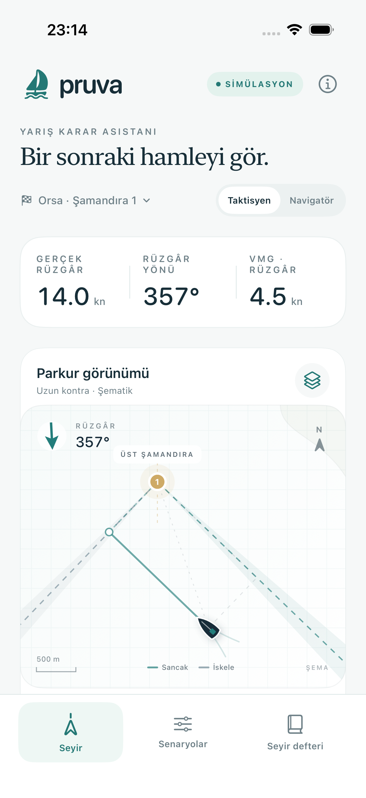
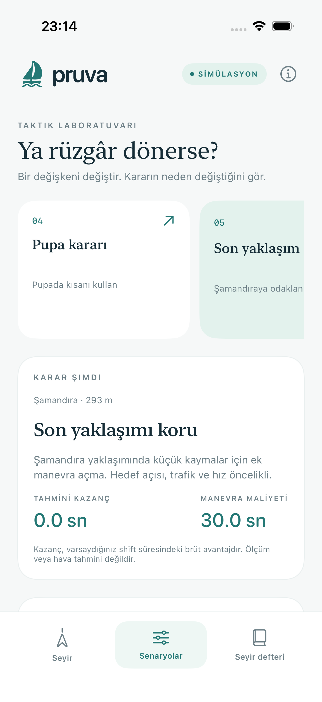
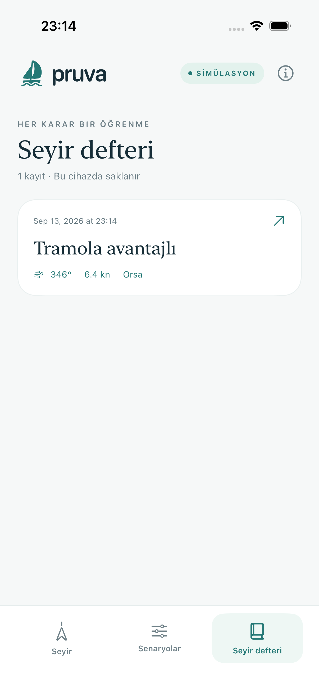
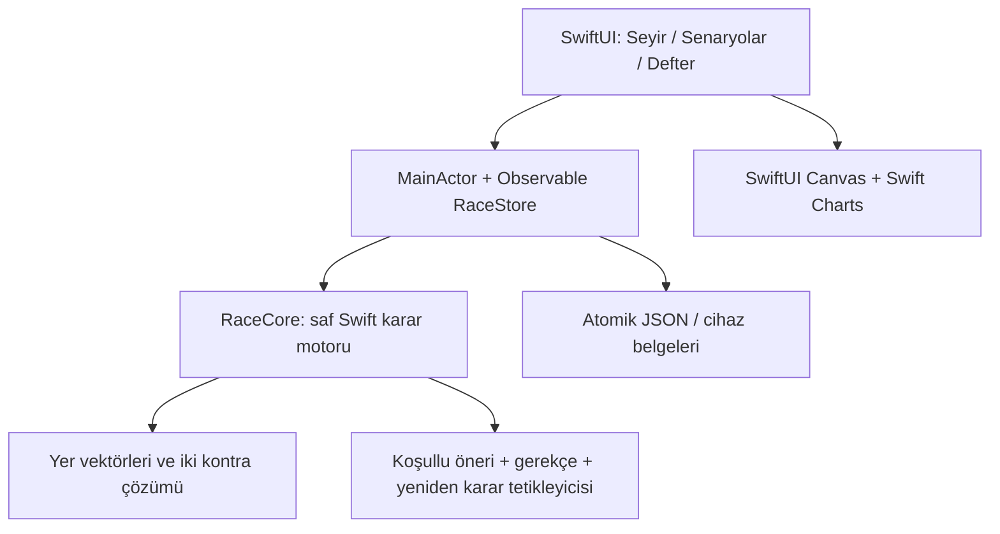

# Pruva

**Rotayı gör. Doğru anda karar ver.**

iPhone ve iPad için yerel SwiftUI yarış karar asistanı. Taktisyen ve navigatörün rüzgâr, layline, kontra payı ve manevra maliyetini aynı görsel üzerinden değerlendirmesi için tasarlandı. Yumuşak beyaz, deniz yeşili, koyu arduvaz ve küçük altın vurgular.

Bu sürüm **çalışan bir çevrimdışı simülasyon / manuel karar laboratuvarıdır**. GPS, NMEA, AIS, kamera veya hava servisine bağlı değildir. Simülasyon durumu uygulamada sürekli görünür.

<p>
  
  
  
</p>

[iPad ekranını görüntüle](docs/screenshots/ipad-seyir.png)

## Çalışan özellikler

- **Seyir:** dokunarak taşınabilen tekne, rüzgâra ve akıntıya göre dönen layline'lar, alternatif kontra yolları, belirsizlik bantları, ölçekli şematik parkur.
- **İki ekip rolü:** taktisyen için VMG ve karar gerekçesi; navigatör için VMC, yer rotası, hedef mesafesi ve kontra süreleri.
- **Karar motoru:** ortalamaya göre shift, uzun/kısa kontra, ek manevra maliyeti, kullanılabilir süre, basınç varsayımı, kirli hava ve son yaklaşım.
- **Senaryolar:** uzun kontra, süren kafalama, layline eşiği, pupa ve son yaklaşım. Hız, açı, shift, akıntı ve maliyet kaydırıcıları anında hesaplanır.
- **Rüzgâr oynatma:** örnek salınımı başlat/duraklat; kullanıcı girdilerinden oluşan grafik. Referans değişince grafik aynı gerçek yönleri yeni ortalamaya göre gösterir.
- **Seyir defteri:** karar ve ekip notunu cihazda sakla; eski koşulları haritada aç; farklı rüzgârla karşılaştır; metin notunu iOS paylaşım menüsünden dışa aktar.
- iPhone'da dikey akış, geniş iPad ekranında parkur ve kararın yan yana yerleşimi.

## Xcode'da çalıştırma

1. `Pruva.xcodeproj` dosyasını Xcode ile açın.
2. `Pruva` scheme'ini ve bir iPhone/iPad simülatörünü seçin.
3. **Run**. Harici paket, sunucu, hesap veya API anahtarı gerekmez.

Minimum hedef **iOS / iPadOS 17**; Swift 5.9 veya üstü. Fiziksel cihaz için Signing & Capabilities altında kendi Apple geliştirme takımınızı seçin. App Store / TestFlight dağıtımı bu depoya push etmekten ayrı bir adımdır; bu çalışma kapsamında yapılmadı.

Proje tanımını yeniden üretmek gerekirse, kurulu [XcodeGen](https://github.com/yonaskolb/XcodeGen) ile `xcodegen generate` çalıştırın. Üretilmiş Xcode projesi depoda bulunduğu için normal kullanımda bu araç gerekli değildir.

```sh
swift test
xcodebuild -project Pruva.xcodeproj -scheme Pruva \
  -destination 'generic/platform=iOS Simulator' \
  -derivedDataPath build CODE_SIGNING_ALLOWED=NO build
```

Arayüz testleri için `xcodebuild -showdestinations -scheme Pruva -project Pruva.xcodeproj` çıktısından bir simülatör seçip `-destination 'platform=iOS Simulator,id=…' test` kullanın. `PruvaUITests` senaryo geçişini, rol/katman kontrollerini ve karar kaydını gerçek uygulama üzerinden doğrular.

## Mimari



- [iOS mimarisi ve sensör/video yol haritası](docs/ARCHITECTURE.md)
- [Karar denklemleri, birimler ve varsayımlar](docs/DECISION_MODEL.md)
- [Ürün akışı ve görsel dil](docs/PRODUCT.md)
- [Doğrulama kaydı](docs/VALIDATION.md)

`Sources/RaceCore` yalnız Foundation kullanır ve Swift Package olarak bağımsız test edilir. `Pruva` görünüm ve cihazda saklama katmanıdır. İş mantığı Canvas çizim koduna bağlı değildir.

## Modelin sınırları

Girdi hızları knot, konumlar yerel doğu/kuzey düzleminde metre, süreler saniye ve rüzgâr yönü kuzeyden saat yönünde **geldiği yön** olarak tanımlıdır. Yer hızı = suya göre tekne hızı + akıntı. Gerçek coğrafi konum kullanılmaz.

Kazanç modeli güncel rüzgârın verilen süre boyunca devam edip sonra girilen ortalamaya döndüğü iki varsayımsal rotayı karşılaştırır. Bu bir tahmin servisi değildir. Basınç faydası iki rotanın diğer kontradaki **farklı maruz kalma süresine** uygulanan yaklaşık katkıdır. Tekne hızı ve hedef açı kullanıcı girdisidir; rüzgâr hızından otomatik polar türetilmez. Güven etiketleri ölçülmüş olasılık değildir.

Şematik parkur deniz haritası değildir. Yarış kuralları, rakip önceliği ve temiz manevra alanı ekip tarafından değerlendirilir. NMEA/GPS, tekneye özel polar, filo takibi ve video üzerine veri bindirme sonraki fazlarda ayrı veri adaptörleriyle eklenmek üzere planlandı.

Temel ürün mantığı, kullanıcının [paylaşılan yarış stratejisi konuşmasından](https://chatgpt.com/share/6aa68eb3-a6ec-83eb-b5ba-6226bfed7c7d) türetildi. Yelken ve Apple birincil kaynakları mimari/karar belgelerinde bağlantılıdır.
