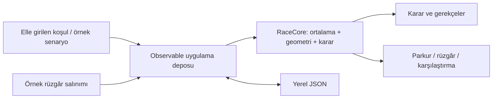

# Pruva — iOS mimarisi

Pruva, taktisyen ile navigatörün aynı yarış durumunu görüp kararın gerekçesini tartışmasını sağlayan yerel bir iOS uygulamasıdır. İlk sürümün veri kaynağı elle değiştirilen örnek senaryolardır. Ekrandaki rüzgâr, tekne, süre ve kazanç değerleri simülasyondur; GPS, tekne enstrümanları veya hava tahmini bağlantısı değildir.

## Temel kararlar

| Alan | Tercih | Gerekçe |
| --- | --- | --- |
| Platform | iOS 17+, SwiftUI | iPhone ve iPad için tek yerel arayüz; Apple araçlarıyla derlenebilir proje |
| Hesap | Yerel Swift paketi `RaceCore` | Geometriyi ve öneri kurallarını arayüzden bağımsız, deterministik test etmek |
| Durum | `@Observable` uygulama deposu | Senaryo, kullanıcı ayarları ve seçimi tek yerde tutmak; türetilmiş sonuçları aynı girdiden üretmek |
| Kayıt | Uygulama sandbox'ında JSON | Hesapsız, sunucusuz başlangıç; küçük ayar ve kayıtlar için okunabilir yerel veri |
| Parkur | SwiftUI `Canvas` ve yerel kontroller | Tekne, şamandıra, layline, rota ve rüzgârın vektörel çizimi |
| Oynatma | Rüzgâr kaydırıcısı ve örnek salınım oynatma | Koşul değişiminin karşılaştırması; gerçek video veya telemetri kaydı iddiası olmadan görsel öğrenme |

Observation, gözlenen modelin değişiklikleriyle arayüzü güncellemek için kullanılır. Canvas, çok sayıdaki parkur çizgisini tek çizim bağlamında üretir. Etkileşimli düğmeler ve erişilebilir açıklamalar ayrı SwiftUI öğeleri olarak kalır; yalnızca çizilmiş piksellerden oluşan bir kontrol kullanılmaz. [Apple Observation](https://developer.apple.com/documentation/observation), [Apple Canvas](https://developer.apple.com/documentation/swiftui/canvas).

## Veri akışı

`RaceCore`, SwiftUI, ağ, dosya sistemi veya cihaz sensörlerine bağımlı olmamalıdır. Uygulama katmanı kullanıcı girdisini doğrular, tek bir anlık durum üretir ve motoru çağırır. Harita ve karar kartı aynı sonuca bağlanır; her görünümün ayrı taktik hesap yapması engellenir. UI çizimleri yalnızca koordinat dönüşümü ve sunum yapar.

Paketin sorumlulukları `RaceModels.swift` (girdi/çıktı değerleri), `RaceEngine.swift` (dairesel ortalama, rota çözümü, fayda hesabı ve öneri) ve `DemoScenario.swift` (açıkça örneklenmiş durumlar) arasında ayrılır. Motora verilen referans ortalama bu sürümde senaryo/kullanıcı girdisidir; gerçek zaman penceresinden sensör örneği toplama sonraki ölçüm fazının işidir. `circularMean` yardımcı hesabı, bu ayrımın matematiksel temelini sağlar.

Hesaplar sırasında açısal farklar sarmalanır; kuzey geçişi düz sayı çıkarmaya bırakılmaz. Birimler tip/alan adlarında açık tutulur: yerel konum metre, geometri vektörleri m/s, süre saniyedir; hız girdileri ile VMG/VMC knot olarak sunulur. Pusula yönü kuzey=0° ve saat yönünde artar; rüzgâr yönü rüzgârın geldiği yöndür. Yerel parkur koordinatları enlem-boylam gibi sunulmaz. Uzak mesafelerde küresel harita projeksiyonu gerektiren gerçek GPS rotalama, bu ilk sürümün kapsamına girmez.

## Kalıcılık ve sahiplik

Uygulama deposunun UI durumu ana aktörde yönetilmelidir; sensör alımı eklendiğinde bu sınır özellikle korunacaktır. JSON yalnızca kalıcı ayarları ve kullanıcı kayıtlarını saklar; çizim geometrisi veya geçici ekran seçimi kaydedilmez. Karar kaydında giriş anlık durumu, başlık, tarih ve ekip notu bulunur; sayısal analiz girdiden yeniden üretilir. İleriki format değişiklikleri için şema sürümü ve geçiş katmanı eklenmesi planlanır. Kayıt başarısızlığı kullanıcıya gösterilir; bellekteki değişikliğin diske yazıldığı varsayılmaz.

Mevcut yerel kullanım için sunucu ve kullanıcı hesabı gerekmez. Fotoğraf, video, konum ve yerel ağ izinleri ilgili özellik gerçekten eklendiğinde, kullanım anında istenir. Kullanıcı kayıtları gelecekte paylaşılırsa dışa aktarma önizlemesi ve açık paylaşım eylemi gerekir.

## Geliştirme fazları

| Faz | Teslimat | Geçiş şartı |
| --- | --- | --- |
| 1 — Bu sürüm | Çalışan yerel arayüz; elle ayarlanabilen simülasyon; temel karar motoru; görsel senaryo inceleme | Çekirdek regresyon testleri, iOS derlemesi, küçük/büyük ekran kontrolü |
| 2 — Ölçüm | Core Location konumu/COG/SOG; açıkça tanımlanmış Wi-Fi NMEA 0183 ağ geçidi; zaman damgalı ham kayıt ve dosyadan tekrar oynatma | Cihaz testi, kesinti/eski veri davranışı, saat eşleme, doğrulanmış birim ve yön dönüşümleri |
| 3 — Kalibrasyon | Tekneye özel polar, seyir açısı, leeway, akıntı, manevra kaybı; gözleme dayalı belirsizlik aralığı | Referans tekne loglarıyla hata analizi; kalibrasyon sürümleme |
| 4 — Medya | AVFoundation ile kullanıcının seçtiği videoya zaman eşlemeli rota/rüzgâr/karar işaretleri; açıklamalı klip paylaşımı | Video ve sensör saat farkının ölçümü; yeniden üretilebilir dışa aktarma |
| 5 — Filo | Elle işaretlenen veya izinli kaynaktan alınan rakipler, ayrışma ve risk karşılaştırması | Veri kapsamı/yaşı görünürlüğü; taktik kuralların ayrı doğrulanması |

NMEA 2000 için iPhone'un doğrudan CAN hattına bağlandığı varsayılmaz; desteklenen bir ağ geçidi ve açık taşıma protokolü gerekir. Sensör alımı ileride bir adaptör sınırından motora anlık durum taşır. UI ve motor ham NMEA cümleleri bilmez. Bağlantı kesilirse gerçek veriler sessizce örnek verilerle değiştirilmez.

## Gerçek rüzgâr ve belirsizlik

Ölçüm fazında `apparent`/`true`, tekneye göre/gerçek kuzeye göre ve suya göre/karaya göre referanslar ayrı tutulur. SOG/COG, suya göre hız ve heading yerine kullanılamaz. Akıntıyı bir kez rüzgâr dönüşümünde, bir kez de rota hesabında yanlışlıkla çift saymamak için her vektörün referans çerçevesi belgelenir. Manyetik pusula ile gerçek kuzey farkı, sensör ofseti ve saat gecikmesi kalibrasyonda ele alınır.

Örnek senaryodaki parametreler ölçülmüş bir güven olasılığı oluşturmaz. Gerçek ölçüm fazında veri yaşı, örnek sayısı, yön dağılımı, GPS doğruluğu ve polar uyumu ayrı kalite işaretleri olacaktır. Kalite zayıfsa motor daha az kesin açıklama üretmeli; şamandıraya kesin varış veya garantili kazanç bildirmemelidir.

## Doğrulama

Çekirdek testleri; 359°/1° ortalaması, kontra işaretleri, sabit koşullardaki geometri, akıntı etkisi, negatif etap süreleri, sıfır hız, manevra sayısı farkı ve kalan etapla sınırlı tahmin ufkuna odaklanır. Final yaklaşım ile parkurun dış kenarında olma farklı regresyon örnekleridir. Bu testler sensör doğruluğunu kanıtlamaz.

iOS derlemesine ek olarak simülatörde kaydırıcılar, senaryo geçişi, ayar kalıcılığı ve yatay/dikey taşmalar kontrol edilir. Gerçek deniz kullanımına geçiş için ayrıca fiziksel cihaz, düşük güç, güneş altında okunabilirlik, ıslak el etkileşimi ve cihaz hareketi testleri gerekir. Bunlar ilk masaüstü/simülatör doğrulamasının yerine geçmez.
